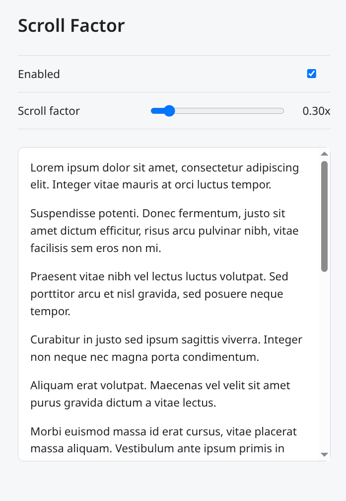

# Scroll Factor

Scroll Factor is a minimal Chrome/Chromium extension for adjusting scroll speed.

It was built after running Fedora/GNOME on a MacBookPro15,1 under Wayland, where touchpad scrolling in Chrome/Electron felt about 3x too fast. The default factor is therefore `0.3`.

Unlike smooth scrolling extensions, Scroll Factor does not add fake animation, momentum, easing, or touchpad detection heuristics. It takes the incoming wheel delta, scales it by the configured factor, and applies the result directly. This ensures maximum accuracy as provided by the hardware. Feel free to enable smooth scrolling in `chrome://flags/`.

## Install

1. Open `chrome://extensions` in Chrome or Chromium.
2. Enable `Developer mode`.
3. Click `Load unpacked`.
4. Select this directory.
5. Open the extension options and adjust the scroll factor.

The extension stores only two settings via Chrome storage: whether it is enabled and the scroll factor.
